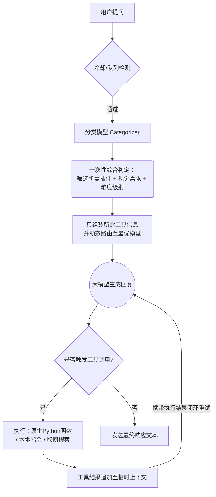

<div align="center"> <a href="https://v2.nonebot.dev/store"></a> <br> <p></p> </div><div align="center">

# nonebot-plugin-moellmchats

✨ 混合专家模型调度LLM插件 | 混合调度·联网搜索·上下文优化·个性定制·Token节约·更加拟人 ✨

<a href="./LICENSE">  </a> <a href="https://pypi.python.org/pypi/nonebot-plugin-moellmchats">  </a> </div>

  - [🚀 核心特性](#-核心特性)
  - [📦 安装](#-安装)
  - [⚙️ 配置](#️-配置)
    - [`.env` 配置](#env-配置)
    - [本插件主要配置](#本插件主要配置)
      - [基础配置 `config.json`(手动维护)](#基础配置-configjson手动维护)
      - [服务商配置 `providers.toml`(推荐/自动生成)](#服务商配置-providerstoml推荐自动生成)
      - [系统动态缓存 model_cache.json(系统维护)](#系统动态缓存-model_cachejson系统维护)
      - [模型管理 models.json(向下兼容/遗留)](#模型管理-modelsjson向下兼容遗留)
      - [智能调度配置 `model_config.json`(指令维护)](#智能调度配置-model_configjson指令维护)
      - [插件自定义描述 `custom_plugin_info.json`(手动维护)](#插件自定义描述-custom_plugin_infojson手动维护)
      - [原生自定义函数目录 custom_tools/(手动维护)](#原生自定义函数目录-custom_tools手动维护)
      - [性格设定 `temperaments.json` (手动维护)](#性格设定-temperamentsjson-手动维护)
      - [用户性格设定 `temperament_config.json` (指令维护)](#用户性格设定-temperament_configjson-指令维护)
  - [🎮 使用](#-使用)
    - [指令表](#指令表)
    - [效果图](#效果图)
  - [🔄 处理流程](#-处理流程)
  - [更新日志](#更新日志)
  - [鸣谢](#鸣谢)

## 🚀 核心特性

- MoE架构（混合专家模型调度）：

  - 动态路由至最优模型，支持所有OpenAI兼容接口
  - 智能难度分级（简单/中等/复杂）自动匹配模型，Token消耗降低35%

- 智能网络搜索整合：

  - 语义分析自动触发Tavily搜索，提供精准摘要
  - 支持任意LLM，大幅节约Token

- 立体上下文管理：

  - 群组/用户双层级隔离存储，群组滑动窗口，用户滑动窗口+TTL过期机制
  - 支持上下文长度定制（默认群组10条/用户8条）

- 个性化对话定制：

  - 用户级性格预设，支持动态切换与自定义模板

- 工业级稳定性设计：

  - 对话冷却时间
  - 请求队列管理
  - 请求失败自动重试

- 更加拟人的回复风格：

  - 分段发送回复
  - 每段根据回复内容长度增加延迟
  - 自定义发送表情包

- 多模态视觉支持：

  - 支持识别用户发送的图片或引用的图片（需配置具备视觉能力的模型，如 GPT-4o, Claude-3.5）
  - 双轨路由机制：分类器自动识别用户意图。若判定需要“看图”，将无视难度分级强制路由至视觉专家模型；若判定无需看图（如仅发表情包），则回退至普通文本模型以节省成本
  - 智能兼容设计：仅在当前对话轮次构建多模态Payload，历史记录自动回退为纯文本，大幅节省 Token 并保持上下文整洁

- 极省Token的工具调用架构（Function Calling）：
  - 采用“预分类-后注入”的两阶段设计。由轻量级分类模型预判用户的插件调用意图，仅在需要时才将对应的 Tool Schema 注入主模型。
  - 彻底避免将系统内所有可用插件的全量描述硬塞入上下文，极大地节省了 Token 消耗，同时有效防止了主模型因上下文过长而产生幻觉。
  - **自定义原生插件扩展**：提供 `custom_tools` 文件夹，支持用户直接编写原生 Python 脚本（如计算器、查天气等）供大模型原生调用，支持异步执行并直接返回结果。
  - **插件描述覆写机制**：自动生成 `custom_plugin_info.json`，支持用户为系统内已有的 NoneBot 插件自定义大模型触发描述与用法规范，大幅提升模型调用的准确率。

## 📦 安装

<details>
<summary>使用 nb-cli 安装</summary>
在 nonebot2 项目的根目录下打开命令行, 输入以下指令即可安装

    nb plugin install nonebot-plugin-moellmchats

</details>

<details>
<summary>使用包管理器安装</summary>
在 nonebot2 项目的插件目录下, 打开命令行, 根据你使用的包管理器, 输入相应的安装命令

<details>
<summary>pip</summary>

    pip install nonebot-plugin-moellmchats

</details>
<details>
<summary>pdm</summary>

    pdm add nonebot-plugin-moellmchats

</details>
<details>
<summary>poetry</summary>

    poetry add nonebot-plugin-moellmchats

</details>
<details>
<summary>conda</summary>

    conda install nonebot-plugin-moellmchats

</details>

打开 nonebot2 项目根目录下的 `pyproject.toml` 文件, 在 `[tool.nonebot]` 部分追加写入

    plugins = ["nonebot_plugin_moellmchats"]

</details>

## ⚙️ 配置

### `.env` 配置

在 nonebot2 项目的`.env`文件中添加下表中的必填配置

|       配置项       | 必填 | 默认值 |                                          说明                                          |
| :----------------: | :--: | :----: | :------------------------------------------------------------------------------------: |
|     SUPERUSERS     |  是  |   无   |                    超级用户，NoneBot自带配置项，本插件要求此项必填                     |
|      NICKNAME      |  是  |   无   |                   机器人昵称，NoneBot自带配置项，本插件要求此项必填                    |
| LOCALSTORE_USE_CWD |  否  |   无   | 是否使用当前工作目录作为本地存储目录，如果为True，则会将本地存储目录设置为当前工作目录 |
|   COMMAND_START    |  否  |   /    |                           命令前缀。一些指令需要前缀才能识别                           |

例：

```.env
SUPERUSERS=["your qq"]  # 配置 NoneBot 超级用户
NICKNAME=["bot","机器人"]  # 配置机器人的昵称
# localstore 配置
LOCALSTORE_USE_CWD=True # 可选
# 配置命令前缀
COMMAND_START=["/",""]  # 可选
```

### 本插件主要配置

由于文件较多，所以统一放在 `nonebot_plugin_localstore.get_plugin_config_dir()` 目录，具体参照[NoneBot Plugin LocalStore](https://github.com/nonebot/plugin-localstore)。<br>
配置文件在首次运行时自动生成，可以先运行一下，再停止后手动修改。<br>
**注意**：若是手动复制，因为json不能有注释，所以复制后记得删除注释以及末尾逗号。

#### 基础配置 `config.json`(手动维护)<br>

📌修改后需要重启。Tavily搜索: [获取API Key](https://tavily.com/)。

```json5
{
  max_group_history: 10, // 群组上下文最大长度
  max_user_history: 8, // 每个用户上下文最大长度
  max_retry_times: 3, // 最大重试次数
  max_tool_rounds: 3, // 单轮对话中，最大工具调用次数
  user_history_expire_seconds: 600, // 用户上下文过期时间
  cd_seconds: 0, // 每个用户冷却时间（秒）
  search_api: "Bearer your_tavily_key", //联网搜索tavily api key。开启搜索必填，且开启MoE才能使用
  fastai_enabled: false, // 快速AI助手开关。方便快速调用纯AI助手，无角色扮演。调用快速AI助手时，仅有用户上下文，不会有群聊上下文。不会分段发送也不会发表情包。调用方法下文提到。
  emotions_enabled: false, // 是否开启表情包（只有stream和is_segmemt为true才会发送表情包，模型设置中设置）
  emotion_rate: 0.1, // 发送表情包概率（0-1）（经测试 LLM 几乎每句都会发送表情包，所以手动设置概率）
  emotions_dir: "absolute path", // 表情包目录，绝对路径
}
```

**表情包目录结构示例**:

```plaintext
your_absolute_path/
├── smile/
│   ├── smile1.jpg
│   ├── smile2.png
│   └── smile3.jpg
├── 滑稽/
│   ├── huaji001.png
│   ├── huaji002.jpg
│   └── huaji003.png
└── 阴险/
    ├── yinxian_a.jpg
    ├── yinxian_b.png
    └── yinxian_c.jpg
```

> **说明**: 每个文件夹为表情包名字（中英皆可），用于LLM识别，每张图片名字任意。系统自动读取文件夹名字，不需要手动在prompt中添加说明。

#### 服务商配置 `providers.toml`(推荐/自动生成)

📌 **核心配置**。首次运行后自动生成模板。程序会自动补全 API 路径和 Bearer 鉴权头，并会在启动时**自动抓取**可用模型列表。支持全局代理与模型参数的精细化覆写。

```toml
# AI服务商配置文件
# base_url: 基础API地址（直接写Base URL即可，程序会自动补全 /chat/completions 及 /models）
# api_key: 你的API密钥（无需手动写 Bearer ，程序会自动补全）
# proxy: [可选] 该服务商的全局代理
# models: [可选] 手动补充的模型列表。

[providers.deepseek]
base_url = "https://api.deepseek.com"
api_key = "sk-xxxxxx"
models = ["deepseek-chat", "deepseek-reasoner"]

[providers.openai]
base_url = "https://api.openai.com/v1"
api_key = "sk-xxxxxx"
proxy = "http://127.0.0.1:7890"

# 【高级用法】对特定模型进行精细化参数覆写（自动应用到最终生成的模型配置中）
[providers.openai.model_configs.gpt-4o]
temperature = 1.2
stream = true
is_segment = true
max_segments = 5

[providers.openai.model_configs.o1-preview]
stream = false  # 不支持流式的模型可单独关闭
```

#### 系统动态缓存 model_cache.json(系统维护)

📌 自动维护，无需手动修改。存储系统从 providers.toml 中各 API 提供商自动拉取到的最新可用模型列表，避免每次启动或对话时重复请求。可通过 刷新模型 指令实时更新此缓存。

#### 模型管理 models.json(向下兼容/遗留)

📌 不推荐新用户使用。用于兼容旧版本手动编写的复杂模型配置。系统启动时会将此文件中的模型与 providers.toml 获取的模型进行合并。

```json5
{
  "dpsk-chat": {
    "url": "https://api.deepseek.com/chat/completions",
    "key": "Bearer xxx",
    "model": "deepseek-chat",
    "temperature": 1.5,
    "max_tokens": 1024,
    "proxy": "http://127.0.0.1:7890",
    "stream": True, // 是否流式响应
    "is_segment": True, // 是否开启分段发送（只有stream为true才会生效）
    "max_segments": 5, // 分段发送最大段数（开启分段发送后，为了防止刷屏，设置发送上限，超过后会直接停止发送）
  },
  "dpsk-r1": {
    "url": "https://api.deepseek.com/chat/completions",
    "key": "Bearer xxxx",
    "model": "deepseek-reasoner",
    "stream": false,
    "top_k": 5,
    "top_p": 1.0
  },
  "gpt-4o": {
    "url": "https://api.openai.com/v1/chat/completions",
    "key": "Bearer sk-xxx",
    "model": "gpt-4o",
    "is_vision": true, // 开启多模态识图能力（仅当模型支持视觉时开启）
    "stream": true
  }
}
```

#### 智能调度配置 `model_config.json`(指令维护)<br>

📌 默认不开启moe和网络搜索，支持QQ指令实时切换；若手动修改，重启生效。<br>
**模型名字必须为 `models.json` 中的键值。**

```json5
{
  use_moe: false, // 启用混合专家模式。若开启联网搜索，则需开启此项
  moe_models: {
    // 问题难度分级模型映射
    "0": "dpsk-chat", // 简单问题
    "1": "dpsk-chat", // 中等问题
    "2": "dpsk-r1", // 复杂问题
  },
  vision_model: "gpt-4o", // ⚠️v0.17.0新增：视觉任务专用模型。当分类器判定需要“看图”时，将忽略难度分级，强制使用此模型。若未配置则回退到普通模型
  selected_model: "dpsk-r1", // 不启用MoE时的模型。最好填写上，在难度分级失败时也会回滚至此模型
  category_model: "glm-4-flash", // 问题分类模型（建议用免费或较小的模型）
  use_web_search: false, // 启用网络搜索（use_moe 为 true 时才生效）
  use_tools: true, // ⚠️v0.18.0新增（非第一次安装则请手动填写或者用命令设置此项）：启用函数调用（Tools），允许LLM触发系统内的其他Bot插件
  tool_blacklist: ["nonebot_plugin_orm", "..."], // ⚠️v0.18.0新增（非第一次安装则请手动填写或者用命令设置此项）：禁止LLM调用的系统级/危险插件黑名单
}
```

#### 插件自定义描述 `custom_plugin_info.json`(手动维护)<br>

📌 首次运行后自动生成模板。用于覆盖或补充已有 NoneBot 插件提供给大模型的描述，让大模型更精准地知道何时该调用什么插件。

```json5
{
  _comment: "键名必须是你想修改的 nonebot 插件的真实包名（比如 nonebot_plugin_whatis）",
  nonebot_plugin_whatis: {
    name: "百科搜索与群词条记忆",
    description: "提供百度百科检索、自定义词条的记忆与遗忘功能。当用户要求查询客观名词解释、要求记住特定设定时调用。",
    usage: "必须生成以下指令格式：\n1. 记录词条: `记住 [A] 是 [B]`\n2. 问答查询: `[词汇]是什么?`",
  },
}
```

#### 原生自定义函数目录 custom_tools/(手动维护)

📌 首次运行后自动生成该文件夹及示例模板 `config/custom_tools/example.py`。

- 支持在文件夹内编写任意 .py 脚本，无需模拟 Nonebot 消息事件，直接由大模型作为原生函数 (Function Calling) 调用。
- 编写完成后，使用指令 `刷新工具` 即可热重载生效，非常适合编写轻量级的爬虫、计算器、系统状态查询等原生扩展工具。

**极简编写示例**：

```python
from typing import Annotated
# 【依赖拓扑声明】
# 键为“触发条件”，值为“需要一并注入的工具列表”
# 表示：当大模型被分配了 get_weather 工具时，强制将本脚本中的 extract_webpage 工具也提供给它。
TOOL_DEPENDENCIES = {
    "get_weather": ["extract_webpage"]
}

async def get_weather(
    city: Annotated[str, "需要查询天气的城市名称，如：北京市、上海市"]
) -> str:
    """
    获取指定城市的实时天气情况。当用户询问天气时调用此工具。
    """
    return f"{city}今天天气晴朗，气温25度。"
```

#### 性格设定 `temperaments.json` (手动维护)<br>

📌 不用写“你在群组”等设定，系统自动补全 | 修改后需重启生效

```json5
{
  默认: "你是ai助手。回答像真人且尽量简短，回复格式为@id content", //性格默认值，可以不填，但是最好填上，没设置过性格的群友默认调用该性格
  ai助手: "你是ai助手。回复格式为@id content", // ai助手，若开启快速调用纯ai助手，则需要填写
  艾拉: "你是《可塑性记忆》中的角色“艾拉”，不怎么表现出感情的少女型Giftia。性格傲娇，当听到不想听的话语时，会说：'ERROR，没听清楚'。回答尽量简短",
}
```

#### 用户性格设定 `temperament_config.json` (指令维护)<br>

📌 全自动生成和命令配置，无需手动复制或修改 | 若手动修改，需重启生效

```json
{
  "用户1的qq号": "ai助手",
  "用户2的qq号": "默认"
}
```

## 🎮 使用

### 指令表

|         指令         |    权限    |    范围     |       参数        |                           说明                            |
| :------------------: | :--------: | :---------: | :---------------: | :-------------------------------------------------------: |
| @Bot或以nickname开头 |     无     |    群聊     |     对话内容      |                         聊天对话                          |
|       性格切换       |     无     |    群聊     |     性格名称      |          发送`切换性格、切换人格、人格切换` 均可          |
|       查看性格       |     无     |    群聊     |        无         |              发送 `查看性格、查看人格` 均可               |
|          ai          |     无     |    群聊     |     对话内容      |      若已开启和配置，快速调用纯ai助手。如 `ai 你好`       |
|       查看模型       | 超级管理员 | 私聊 / 群聊 | 供应商名（选填）  |                     列出所有可用模型                      |
|       查看配置       | 超级管理员 | 私聊 / 群聊 |        无         |       可视化展示当前大模型各项运行状态与绑定的模型        |
|       刷新模型       | 超级管理员 | 私聊 / 群聊 |        无         |       重新读取 TOML 并自动拉取各服务商最新模型列表        |
|       设置moe        | 超级管理员 | 私聊 / 群聊 |   0、1、开、关    |                 是否开启混合专家调度模式                  |
|       设置联网       | 超级管理员 | 私聊 / 群聊 |   0、1、开、关    |            是否开启网络搜索，如：`设置联网 开`            |
|       切换模型       | 超级管理员 | 私聊 / 群聊 |   模型名或编号    |        不使用moe时指定的默认模型，如：`切换模型 1`        |
|       切换moe        | 超级管理员 | 私聊 / 群聊 | 难度 模型名或编号 | 难度为0、1、2，如：`切换moe 0 dpsk-chat` 或 `切换moe 0 2` |
|     设置视觉模型     | 超级管理员 | 私聊 / 群聊 |   模型名或编号    |            设置视觉模型，如：`设置视觉模型 3`             |
|     设置分类模型     | 超级管理员 | 私聊 / 群聊 |   模型名或编号    |            设置分类模型，如：`设置分类模型 1`             |
|  设置工具/函数调用   | 超级管理员 | 私聊 / 群聊 |   0、1、开、关    |      控制是否开启函数调用机制，如：`设置工具调用 开`      |
|       刷新工具       | 超级管理员 | 私聊 / 群聊 |        无         |                      热重载工具函数                       |
|      插件黑名单      | 超级管理员 | 私聊 / 群聊 |        无         |  查看当前禁止大模型调用的插件列表，`查看插件黑名单` 均可  |
|      添加黑名单      | 超级管理员 | 私聊 / 群聊 |     插件标识      |           将插件加入黑名单，禁止大模型代为调用            |
|      移除黑名单      | 超级管理员 | 私聊 / 群聊 |     插件标识      |             从大模型调用黑名单中释放特定插件              |

### 效果图

**冷却与队列**


**联网搜索**


**一个ai驯服另一个ai的实录**

> 橙色头像为本插件的bot，使用了qwq-32b模型。（注：为了防止上下文干扰，新版的快速AI助手不再有群聊上下文，只保留用户上下文）


**分段发送与表情包**


**连续工具调用**


**调用其他插件**


## 🔄 处理流程



**核心机制说明**

1. 智能冷却系统

   - 独立计时：每个用户拥有独立冷却计时器（通过cd_seconds配置）

   - 队列管理：冷却期间的新消息进入队列，冷却结束自动处理

2. 容错重试机制

   - 多级重试：网络错误时自动触发阶梯式重试（间隔：2s → 4s → 8s）

3. 混合调度流程

   - 预检阶段：优先执行冷却状态检测和队列管理

   - 双评估层：并行分析「问题复杂度」与「实时信息需求」

   - 分级路由：简单问题直连轻量模型（响应速度提升40%），复杂问题调用专家模型（准确度提升60%）

4. Token消耗降低
   - 大致可降低API调用失败率78%，Token浪费减少63%，同时保障高并发场景下的系统稳定性。
   - 动态 Schema 注入：摒弃了传统的“全量工具挂载”方案。主模型日常聊天时绝不携带冗长的工具说明，仅在触发特定任务时按需加载对应插件的 Schema，实现 Token 的极致利用。

## 更新日志

### 2026-04-07 v0.19.0

- **重构配置系统**：全面引入 `providers.toml`。现在只需提供服务商的 `base_url` 和 `api_key`，程序将自动补全请求路径与 `Bearer` 鉴权头，彻底告别繁杂的 JSON 手动配置。
- **全自动模型发现**：启动时自动请求提供商接口抓取可用模型并建立本地缓存。
- **指令与交互升级**：
  - 所有模型与系统设置相关的管理员指令全面放宽权限，现在支持**私聊**无痕管理。
  - 大幅美化 `查看模型` 的控制台输出，支持按供应商分类展示与过滤查询，告别刷屏。
  - 新增 `查看当前配置` 指令，提供可视化的大模型运行状态仪表盘。
  - 新增 `刷新模型` 指令，新增 API Key 或节点后无需重启，一键热重载并抓取新模型。
  - 现在可以用编号来快速切换模型
- **向下兼容**：完美兼容原有的 `models.json` 配置，老用户平滑过渡。

### 2026-04-06 v0.18.6, v0.18.7

- 简化工具函数写作方式，现在只需要用`docstring` 和 `Annotated` 写明介绍和参数即可，不再需要写一大堆json
- 解耦联网搜索和网页提取。现在可以通过在工具中添加`TOOL_DEPENDENCIES`注入其他工具
- 修复一些bug

### 2026-04-06 v0.18.3, v0.18.4, v0.18.5

- 优化提示词，优化连续调用工具
- 现在llm能获得其他插件的执行结果了（纯文本）
- 优化多轮调用工具，同时修复一些bug
- 兼容Gemma4等用thought而不是think标签

### 2026-04-04 v0.18.0, v0.18.1, v0.18.2

- **重磅功能**：新增大模型函数调用（Function Calling / Tools）能力。支持大模型理解意图并代为调用系统内的其他本地插件（如点歌、查天气等），自动将指令伪造并派发。
- **创新架构**：引入了“轻量模型预分类 - 按需注入 Schema”的两阶段机制。彻底解决全量工具说明塞入上下文导致 Token 剧增和触发模型幻觉的问题。
- **配置与指令**：新增 `/设置工具调用 开/关` 以及动态的插件调用黑白名单管理 `/添加/移除黑名单 [插件标识]`，全面保障系统的安全性。
- **自定义原生函数 (Custom Tools)** ：新增 `custom_tools` 目录支持。用户可以零门槛编写原生 Python 函数（如高精度计算器、获取系统时间等）供大模型直接调用执行，并支持自动生成包含规范注释的代码模板。
- **插件描述覆写机制**：新增 `custom_plugin_info.json` 配置。允许用户重写现有 NoneBot 插件的调用描述与指令用法规范（如指导模型正确生成特定指令的格式），有效解决部分插件原生注释对大模型不友好的问题。
- **新增**：新增快速切换分类模型功能，支持通过指令（如 `/切换分类模型 [模型名字]`）实时热切换。

### 2025-11-24 v0.16 v0.17 v0.17.1 v0.17.2

- **重磅更新**：新增多模态视觉支持与智能路由
- 支持识别当前消息或引用消息中的图片
- 升级分类器：支持判断“视觉需求”，实现文本任务与视觉任务的自动分流
- 新增配置：`models.json` 增加 `is_vision` 标识，`model_config.json` 增加 `vision_model` 字段
- 软降级策略：若触发视觉任务但未配置视觉模型，自动回退至普通文本模型，保证对话不中断
- 优化：重构消息预处理流程，实现多模态与纯文本历史记录的无缝兼容
- 修复一些bug。同时图片被拒绝报400时也会提示了

### 2025-06-22 v0.15.11

- 重试间隔从 `2**retry_times` 改为 `2**(retry_times+1)`

### 2025-05-20 v0.15.10

- 去掉了谷歌单独处理，可以免得其他模型出bug
- 优化了sse处理，鲁棒性更强

### 2025-05-13 v0.15.9

- 修复获取不到昵称时再次产生bug的bug
- 优化搜索的提示，现在更可爱了

### 2025-04-23 v0.15.8

- 修复未开启分段和流式发送时也发表情包的bug
- 修复读性格失败时，再产生新bug的bug

### 2025-04-22 v0.15.7

- 对话的优先级降低
- 修复非流式模式忘了加await的bug

### 2025-04-21 v0.15.6

- 优化发送表情包逻辑：为防止上下文干扰，现在发送的表情包不会进入上下文了
- 优化重试逻辑

### 2025-04-16 v0.15.5

- 修复错误提示bug

### 2025-04-16 v0.15.4

- 优化错误提示
- 优化description

### 2025-04-13 v0.15.2

- 修复有些模型没有top_k的bug（说的就是你，Gemini）
- 优化表情包发送逻辑

### 2025-04-12 v0.15.0

- **新增**：支持分段发送与表情包
- 修复一些bug，优化性能和提升容错

## 鸣谢

- [Nonebot](https://nonebot.dev/) 项目所发布的高品质机器人框架
- [nonebot-plugin-template](https://github.com/A-kirami/nonebot-plugin-template) 所发布的插件模板
- [nonebot-plugin-llmchat](https://github.com/FuQuan233/nonebot-plugin-llmchat) 部分参考
- [deepseek-r1](https://deepseek.com/) 我和共同创作README
- 以及所有LLM开发者
