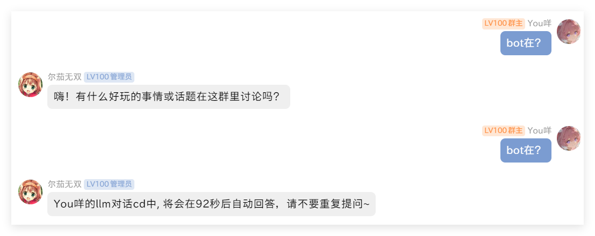
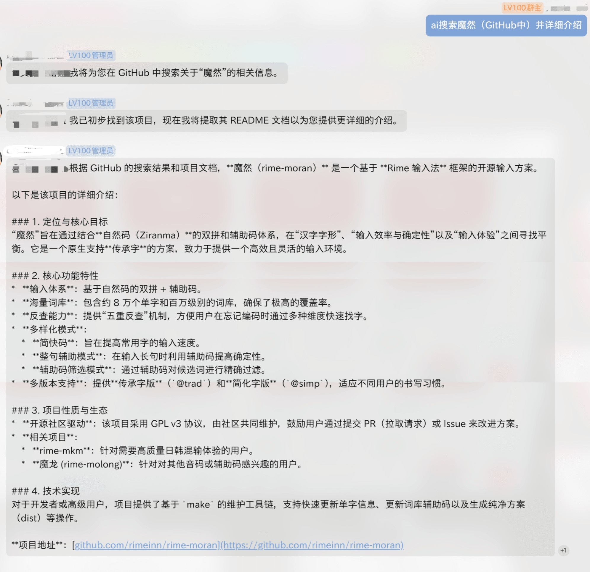
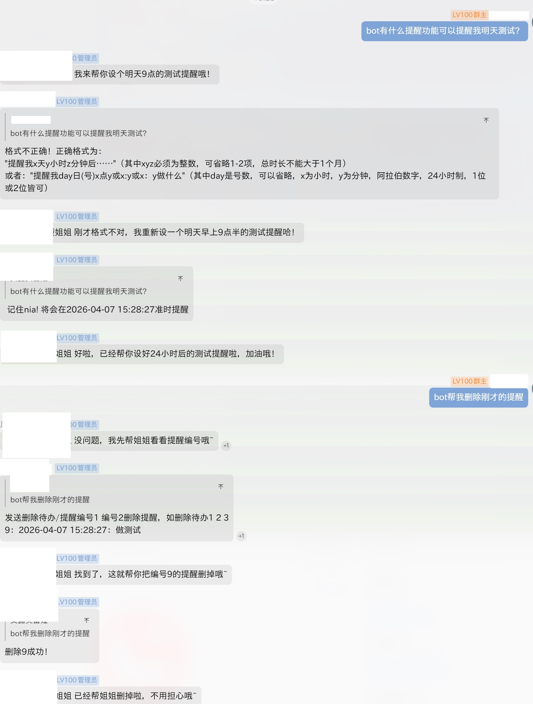
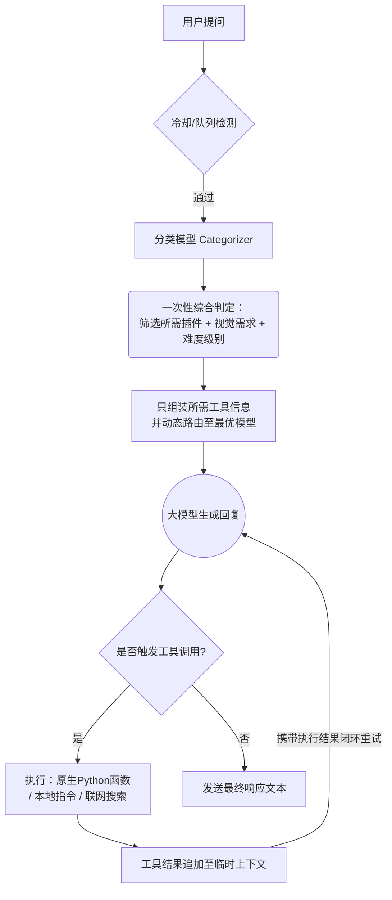

<div align="center"> <a href="https://v2.nonebot.dev/store"></a> <br> <p></p> </div><div align="center">

# nonebot-plugin-moellmchats

✨ 混合专家模型调度LLM插件 | 混合调度·联网搜索·上下文优化·个性定制·Token节约·更加拟人 ✨

<a href="./LICENSE">  </a> <a href="https://pypi.python.org/pypi/nonebot-plugin-moellmchats">  </a> </div>

- [🚀 核心特性](#-核心特性)
- [📦 安装](#-安装)
- [⚙️ 配置](#️-配置)
- [🎮 使用](#-使用)
- [🔄 处理流程](#-处理流程)
- [更新日志](#更新日志)
- [鸣谢](#鸣谢)

## 🚀 核心特性

- **MoE架构（混合专家模型调度）**：动态路由至最优模型，支持所有OpenAI兼容接口；智能难度分级（简单/中等/复杂）自动匹配模型，Token消耗降低35%

- **智能网络搜索整合**：语义分析自动触发Tavily搜索，提供精准摘要，支持任意LLM

- **立体上下文管理**：群组/用户双层级隔离存储，群组滑动窗口，用户滑动窗口+TTL过期机制

- **个性化对话定制**：用户级性格预设，支持动态切换与自定义模板

- **工业级稳定性设计**：对话冷却时间 / 请求队列管理 / 请求失败自动重试

- **更加拟人的回复风格**：分段发送回复，每段根据内容长度增加延迟，支持自定义发送表情包

- **多模态视觉支持**：支持识别用户发送或引用的图片（需配置视觉模型如GPT-4o）；双轨路由机制：判定无需看图时自动回退至普通文本模型以节省成本；历史记录自动回退为纯文本，大幅节省Token

- **极省Token的工具调用架构（Function Calling）**：预分类-后注入两阶段设计，仅在需要时将对应Tool Schema注入主模型；支持编写原生Python工具（`custom_tools/`）；支持覆写NoneBot插件描述（`custom_plugin_info.json`）

## 📦 安装

<details>
<summary>使用 nb-cli 安装</summary>
在 nonebot2 项目的根目录下打开命令行, 输入以下指令即可安装

    nb plugin install nonebot-plugin-moellmchats

</details>

<details>
<summary>使用包管理器安装</summary>
在 nonebot2 项目的插件目录下, 打开命令行, 根据你使用的包管理器, 输入相应的安装命令

<details>
<summary>pip</summary>

    pip install nonebot-plugin-moellmchats

</details>
<details>
<summary>uv</summary>

    uv add nonebot-plugin-moellmchats

</details>

</details>

## ⚙️ 配置

### `.env` 配置

在 nonebot2 项目的`.env`文件中添加下表中的必填配置

|       配置项       | 必填 | 默认值 |                                          说明                                          |
| :----------------: | :--: | :----: | :------------------------------------------------------------------------------------: |
|     SUPERUSERS     |  是  |   无   |                    超级用户，NoneBot自带配置项，本插件要求此项必填                     |
|      NICKNAME      |  是  |   无   |                   机器人昵称，NoneBot自带配置项，本插件要求此项必填                    |
| LOCALSTORE_USE_CWD |  否  |   无   | 是否使用当前工作目录作为本地存储目录 |
|   COMMAND_START    |  否  |   /    |                           命令前缀                           |

例：

```.env
SUPERUSERS=["your qq"]
NICKNAME=["bot","机器人"]
LOCALSTORE_USE_CWD=True  # 可选
COMMAND_START=["/",""]   # 可选
```

### 本插件主要配置

配置文件统一放在 `nonebot_plugin_localstore.get_plugin_config_dir()` 目录（参照 [NoneBot Plugin LocalStore](https://github.com/nonebot/plugin-localstore)），**首次运行时自动生成**。

| 文件 | 维护方式 | 说明 | 修改后是否需重启 |
| :--: | :------: | ---- | :--------------: |
| `providers.toml` | 手动 | **核心**：服务商/API密钥/模型参数，支持四级参数继承 | 否（`刷新模型`指令） |
| `config.json` | 手动 | 基础行为（历史长度、冷却、表情包等） | 是 |
| `model_config.json` | 指令/手动 | MoE调度、视觉/工具开关，支持指令实时切换 | 指令实时；手动需重启 |
| `temperaments.json` | 手动 | 性格预设的system prompt | 是 |
| `custom_plugin_info.json` | 手动 | 覆写NoneBot插件描述以提升LLM调用精准度 | 是 |
| `custom_tools/` | 手动 | 原生Python函数，供LLM直接调用 | 否（`刷新工具`指令） |

**[→ 完整配置参考（含所有字段说明与示例）请见 Wiki](docs/configuration.md)**

其他Wiki页面：[自定义工具开发](docs/custom-tools.md) · [插件集成](docs/plugin-integration.md) · [性格系统](docs/personality.md)

## 🎮 使用

### 指令表

|            指令             |    权限    |    范围     |        参数        |                                   说明                                    |
| :-------------------------: | :--------: | :---------: | :----------------: | :-----------------------------------------------------------------------: |
|    @Bot或以nickname开头     |     无     |    群聊     |      对话内容      |                                 聊天对话                                  |
|          性格切换           |     无     |    群聊     |      性格名称      |                  发送`切换性格、切换人格、人格切换` 均可                  |
|          查看性格           |     无     |    群聊     |         无         |                      发送 `查看性格、查看人格` 均可                       |
|             ai              |     无     |    群聊     |      对话内容      |              若已开启和配置，快速调用纯ai助手。如 `ai 你好`               |
|          查看模型           | 超级管理员 | 私聊 / 群聊 | 搜索关键词（选填） |      列出可用模型，支持多关键词模糊搜索（如：`查看模型 openai 4o`）       |
|          查看配置           | 超级管理员 | 私聊 / 群聊 |         无         |               可视化展示当前大模型各项运行状态与绑定的模型                |
|          刷新模型           | 超级管理员 | 私聊 / 群聊 |         无         |               重新读取 TOML 并自动拉取各服务商最新模型列表                |
|           设置moe           | 超级管理员 | 私聊 / 群聊 |    0、1、开、关    |                         是否开启混合专家调度模式                          |
|          设置联网           | 超级管理员 | 私聊 / 群聊 |    0、1、开、关    |                    是否开启网络搜索，如：`设置联网 开`                    |
|          切换模型           | 超级管理员 | 私聊 / 群聊 |    模型名或编号    |                不使用moe时指定的默认模型，如：`切换模型 1`                |
|           切换moe           | 超级管理员 | 私聊 / 群聊 | 难度 模型名或编号  |         难度为0、1、2，如：`切换moe 0 dpsk-chat` 或 `切换moe 0 2`         |
|        设置视觉模型         | 超级管理员 | 私聊 / 群聊 |    模型名或编号    |                    设置视觉模型，如：`设置视觉模型 3`                     |
|        设置分类模型         | 超级管理员 | 私聊 / 群聊 |    模型名或编号    |                    设置分类模型，如：`设置分类模型 1`                     |
|      设置工具/函数调用      | 超级管理员 | 私聊 / 群聊 |    0、1、开、关    |              控制是否开启函数调用机制，如：`设置工具调用 开`              |
|          刷新工具           | 超级管理员 | 私聊 / 群聊 |         无         |                              热重载工具函数                               |
|         插件黑名单          | 超级管理员 | 私聊 / 群聊 |         无         |                     查看当前禁止大模型调用的插件列表                      |
|        添加插件黑名单        | 超级管理员 | 私聊 / 群聊 |      插件标识      |                   将插件加入黑名单，禁止大模型代为调用                    |
|        移除插件黑名单        | 超级管理员 | 私聊 / 群聊 |      插件标识      |                     从大模型调用黑名单中释放特定插件                      |
|          设置私聊           | 超级管理员 | 私聊 / 群聊 |    0、1、开、关    |                         是否开启超级管理员私聊bot                         |
|    重置我的 / 清空上下文    |     无     | 私聊 / 群聊 |         无         |          清空自己的上下文对话记忆及CD状态（群聊中需要@Bot触发）           |
|        重置全部对话         | 超级管理员 | 私聊 / 群聊 |         无         |        清空所有用户的个人上下文及所有群聊环境记忆（群聊中需@Bot）         |
|   查看常驻插件 / 常驻插件   | 超级管理员 | 私聊 / 群聊 |         无         |         查看当前无视分类模型、强制注入给大模型的常驻插件/函数列表         |
| 添加常驻插件 / 添加常驻函数 | 超级管理员 | 私聊 / 群聊 |   插件/函数标识    | 将指定插件或函数设为常驻，强制大模型加载（如：`添加常驻插件 web_search`） |
| 移除常驻插件 / 移除常驻函数 | 超级管理员 | 私聊 / 群聊 |   插件/函数标识    |                   从常驻插件列表中移除指定的插件或函数                    |
|    查看消耗 / 查询token     | 超级管理员 | 私聊 / 群聊 | 数量或范围（选填） | 查看API Token消耗记录。支持数量(如:`5`)、区间(如:`10-15`)、倒数(如:`-50`) |

### 效果图

**冷却与队列**



**联网搜索**


**一个ai驯服另一个ai的实录**

> 橙色头像为本插件的bot，使用了qwq-32b模型。（注：为了防止上下文干扰，新版的快速AI助手不再有群聊上下文，只保留用户上下文）


**分段发送与表情包**


**连续工具调用**



**调用其他插件**



## 🔄 处理流程



**核心机制说明**

1. **智能冷却系统**：每个用户拥有独立冷却计时器（`cd_seconds`配置）；冷却期间的新消息进入队列，冷却结束自动处理

2. **容错重试机制**：网络错误时自动触发阶梯式重试（间隔：2s → 4s → 8s）

3. **混合调度流程**：预检阶段执行冷却状态检测；并行分析「问题复杂度」与「实时信息需求」；简单问题直连轻量模型，复杂问题调用专家模型

4. **Token消耗降低**：动态Schema注入，日常聊天不携带工具说明，仅在触发特定任务时按需加载对应插件的Schema

## 更新日志

> **📢 完整历史更新日志请移步 [CHANGELOG.md](./CHANGELOG.md) 查看。**

## 鸣谢

- [Nonebot](https://nonebot.dev/) 项目所发布的高品质机器人框架
- [nonebot-plugin-template](https://github.com/A-kirami/nonebot-plugin-template) 所发布的插件模板
- [nonebot-plugin-llmchat](https://github.com/FuQuan233/nonebot-plugin-llmchat) 部分参考
- [deepseek-r1](https://deepseek.com/) 我和共同创作README
- 以及所有LLM开发者
